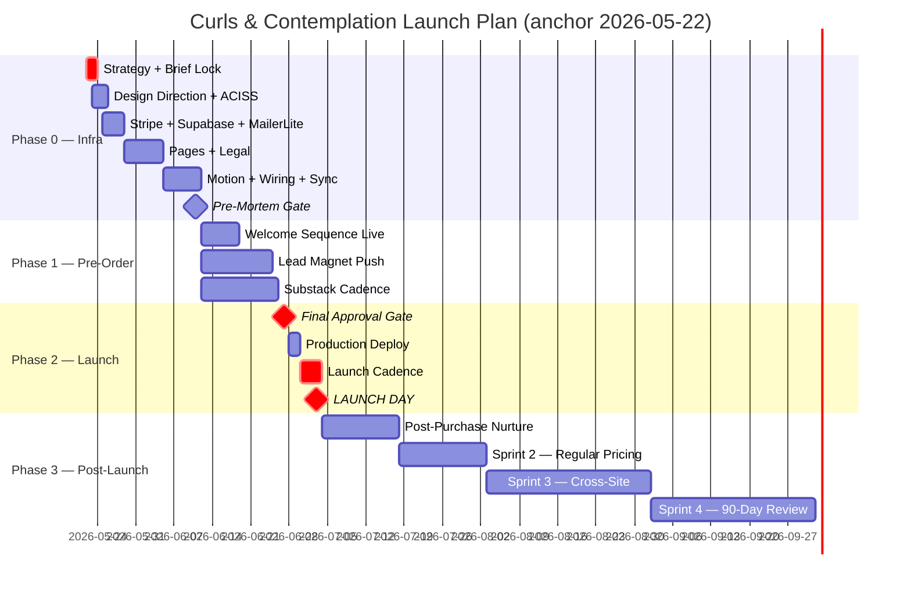

# Launch Timeline — Curls & Contemplation

**Anchor date:** 2026-05-22 (today)
**Release date:** to be set at Strategy Lock `[GATE]` (Phase 2) — placeholder `RELEASE_DATE` used below
**Recommended window:** 35–42 days from anchor (allows full 22-phase pipeline + buffer)

If `RELEASE_DATE = 2026-07-03` (an example 6-week launch), then `T-21 = 2026-06-12`, `T-7 = 2026-06-26`, `T = 2026-07-03`. Adjust all dates below by your real launch.

---

## Phase 0 — Foundation (today → T-21) · "Infra freeze"

**Objective:** every system that touches the launch is wired, tested, and gated.

### Week -1 — Days -7 to 0 (2026-05-15 → 2026-05-21) · BUNDLE PRE-MORTEM FIXES

Apply pre-mortem fixes B1, B6, B8, B9, B10 **before** Phase 0 even starts. Without these, the timeline below is fiction.

| Day | Pre-Mortem ID | Action |
|---|---|---|
| -7 | B1 | Clone `Last/`, `bun install` in `web/`, `bun --hot server.ts`, smoke every route from `02_SITEMAP.md`. Baseline state documented. |
| -6 | B6 | Run studio-site-orchestrator Phase 0–5 dry-run on a throwaway branch. Confirm orchestrator behaves; capture any divergence from the PRD. |
| -5 | B8 | Run `epubcheck CurlsAndContemplationV4.epub`. Output → `Final edits/website/EPUBCHECK_REPORT.md`. If red, fix EPUB before any other step. |
| -4 | B9 | Create `Final edits/website/claims-evidence.md` with every claim (Rihanna, IPPY, Guido Palau, Jimmy Paul) and a dated source. |
| -3 | B10 | Identify one backup approver for non-money gates. Document in `GATE_LEDGER.md`. |
| -2 | — | Buffer day for any miss above. |
| -1 | — | Final read-through of bundle. Open Phase 0. |

If any of the above is red, push the Phase 0 start date later. The pre-mortem is the gate to the timeline, not a parallel workstream.

### Week 0 — Days 1–7 (2026-05-22 → 2026-05-28)

| Day | Workstream | Deliverable | Skill / MCP / connector |
|---|---|---|---|
| 1 | Strategy Lock | `brief.md` locked, `RELEASE_DATE` set | `/studio-site-build-os:studio-site-orchestrator` Phase 2 |
| 1 | Brief Lock | `brief.md` hardened against AI-tell | `/impeccable:impeccable` polish |
| 2 | Design Direction | `design-direction.md` produced | `/taste-skill:design-taste-frontend`, `/design:design-system` |
| 2 | ACISS workspace | `packages/aciss-tokens` builds clean | shell + Style Dictionary |
| 3 | Codemod | `web/styles/main.css` swept of legacy palette | shell codemod from `03_ACISS_TOKENS_SPEC.md` |
| 3 | Architecture Lock | `architecture.md` locked | Phase 5 gate |
| 4 | Stripe sandbox | live-test the webhook signature, refund flow | Stripe MCP `mcp__d6c1a2a4-1d72-471d-b62b-a737bf5b6e67__*` |
| 4 | Supabase setup | private bucket `curls-deliverables`, signed URL flow | Supabase MCP `mcp__f0cedb5d-b90d-4b65-bbe3-c96c97c7f36b__*` |
| 5 | MailerLite groups | 7 groups created, API key in Vercel env | MailerLite MCP `mcp__122e7fb1-db70-4a3a-a188-5a00e26bf2cf__*` |
| 5 | Resend domain | DKIM/SPF/DMARC validated; warm sequence sent | Resend dashboard + DNS |
| 6 | GA4 + Turnstile | property created, consent mode wired | Vercel env, GA4 console |
| 6 | Vercel project | preview pipeline green, `.env` per environment | Vercel MCP `mcp__c4c0c8ed-15e2-4a3b-9001-0768775a3fa8__*` |
| 7 | Phase 0 checkpoint | Tool inventory green; `claude mcp list` clean | `studio-site-orchestrator` Phase 0 |

### Week 1 — Days 8–14 (2026-05-29 → 2026-06-04)

| Day | Workstream | Deliverable | Skill / MCP / connector |
|---|---|---|---|
| 8 | Page scaffolding | Existing `web/` audited (React 19 + Bun bundler); ACISS Tailwind loaded | `frontend-design-author-site` |
| 9 | `/` Home | Hero (static SVG fallback), credibility, email capture | `/figma:figma-generate-design`, `frontend-design-author-site` |
| 10 | `/book` Sales page | Long-form copy, JSON-LD `Book`, Stripe pre-order CTA | `frontend-design-author-site`, `/brand-voice:enforce-voice`, `/humanizer` |
| 11 | `/chapters` + chapter previews | Index + 16 preview pages with `BreadcrumbList` JSON-LD | `frontend-design` |
| 12 | `/blog`, `/faq`, `/about`, `/resources` | All public marketing routes | `frontend-design` |
| 13 | Legal pages × 7 | Privacy, Terms, Refund, Preorder, Digital Delivery, Cookies, Accessibility | `engineering:documentation`, attorney review |
| 14 | Week 1 checkpoint | All routes load 200; design-critique pass | `/design:design-critique`, `/impeccable:impeccable` critique |

### Week 2 — Days 15–21 (2026-06-05 → 2026-06-11) · `T-21 → T-15`

| Day | Workstream | Deliverable |
|---|---|---|
| 15 | Motion layer | Section reveals, page transitions, exit-intent, accordion |
| 15 | Tier-2 hero | Spline scene gated to ≥md + `prefers-reduced-motion: no-preference` |
| 16 | Stripe wiring | `/api/checkout`, webhook idempotent, refund path |
| 17 | Supabase signed-URL | `/api/download/:token` with attempt limit + expiry |
| 18 | MailerLite automations | S1, S3, S4-E2/E3 built and tested with test signup |
| 18 | Resend sequences | S2, S4-E1, S5, S6 wired with templates |
| 19 | Substack sync | RSS cron stages broadcasts; manual approval flow tested |
| 19 | SEO pass | Sitemap.xml + robots.txt + JSON-LD parses clean (rich-results test) |
| 20 | A11y pass | `audit` skill clean to WCAG 2.2 AA |
| 21 | **Phase 0 close** | Pre-mortem `[GATE]` review — every C1–C10 has evidence |

---

## Phase 1 — Pre-Order Push (T-20 → T-7) · "Funnel flywheel"

**Objective:** maximize pre-orders by amplifying lead capture and credibility surfaces.

### Week 3 — `T-20 → T-14`

| Workstream | Action |
|---|---|
| Email | S1 Welcome sequence live; new subscribers begin nurture |
| Lead magnet | Pricing Confidence Kit gated, Sample Chapter ungated; both downloads tracked |
| Substack | First broadcast (S7) goes out — back-catalog post if no fresh one |
| Social | Funnel-supportive posts (see `15_FUNNEL_GENERATOR_PROMPT.md` for the funnel-generation prompt) |
| Paid | Optional: small Meta retargeting on people who hit `/book` but didn't checkout |

### Week 4 — `T-13 → T-7`

| Workstream | Action |
|---|---|
| Email | S1 Welcome continues; S7 Substack runs on its cadence |
| Pre-order checkout | Daily smoke test: one test card purchase + refund |
| Bestseller badge | Pre-launch badge ("Coming July 3 — Pre-Order Now") on `/` and `/book` |
| Performance | Lighthouse run on `/` and `/book` — both must stay ≥95 perf, 100 a11y |
| Substack reciprocity | Cross-post one Curls chapter excerpt onto Substack |

---

## Phase 2 — Launch (T-6 → T) · "Cascade"

**Objective:** orchestrated launch-week cadence with the right email going to the right segment.

### Week 5 — `T-6 → T-3`

| Day | Action |
|---|---|
| T-6 | Final preview deploy approval `[GATE: production launch]` |
| T-5 | Production deploy + DNS verify (CNAME/A); live payment re-test |
| T-4 | Sentry, GA4 events, uptime monitoring confirmed |
| T-3 | S3-E1 (Launch Reminders T-7) goes out (sent T-7 from each subscriber's perspective — the timer is from when they joined `Pre-Orders`, not absolute) |
| T-3 | Final bestseller-badge update if a real result lands |

### Launch week — `T-2 → T`

| Day | Action |
|---|---|
| T-2 | S3-E2 (T-3 email) sends to recent pre-orders |
| T-1 | Final smoke test of launch-day cron `/api/cron/release-ebook` in staging mode |
| T-1 | Substack launch-week post staged |
| T (morning) | Cron triggers bulk fulfillment: all `launch_state=preorder` orders get download tokens + S3-E3 email |
| T (morning) | Site copy flips: "Pre-Order" → "Buy Now"; `/book` headline updated |
| T (morning) | Paperback links (Amazon/B&N/Waterstones/Indigo) go live |
| T (morning) | Launch broadcast goes to full `Subscribers` group (S7-style but launch-themed; manual approval) |
| T (afternoon) | Sentry watch for token download failures |
| T (evening) | First daily metrics check; review/refund inbound triage |

---

## Phase 3 — Post-Launch (T+1 → T+90) · "Compounding"

**Objective:** sustain conversion, nurture buyers into reviews + repeat audience, harden the platform.

### Sprint 1 — `T+1 → T+14`

| Workstream | Action |
|---|---|
| Post-purchase email | S4 sequence live; Day 3 + Day 14 send |
| Review campaign | At Day 14, S4-E3 asks for Amazon/Goodreads review |
| Fast-Follow Tigers | C11–C16 closed out per `06_PRE_MORTEM.md` |
| Paid | Optional: small Amazon Ads on top performing-keywords surfaced via review velocity |
| Substack | Two posts per week through the launch month |

### Sprint 2 — `T+15 → T+30`

| Workstream | Action |
|---|---|
| Regular pricing | $19.99 price tier activates automatically at T+15 (date math in `/checkout`) |
| Mailchimp deprecation | Freeze keys; export final CSV; archive group |
| Quarterly tokens | First quarterly token cleanup cron run |
| Performance audit | Lighthouse on full route list; remediate any drift |

### Sprint 3 — `T+31 → T+60`

| Workstream | Action |
|---|---|
| Track Tigers | C17–C19 monitored; corrective action only if triggered |
| Cross-platform | Begin Finder's Book handoff (next-turn bundle); ACISS tokens cross-consumed |
| Author portfolio | `michaeldavidjr.beauty` cross-canonical audit |

### Sprint 4 — `T+61 → T+90`

| Workstream | Action |
|---|---|
| Quarterly review | 90-day metrics retrospective vs targets (see `01_WEBSITE_PRD_FINAL.md` § 10) |
| Pre-mortem rerun | Re-run `pre-mortem` skill against real launch data |
| Edition planning | Decide on second-edition timing if metrics support it |

---

## Mermaid (paste into a `.mermaid` viewer)

---

## Gate ledger checkpoints

| Gate | Earliest | Latest | Owner |
|---|---|---|---|
| Strategy Lock | Day 1 | T-21 | Michael |
| Brief Lock | Day 1 | T-21 | Michael |
| Design Lock | Day 2 | T-18 | Michael |
| Architecture Lock | Day 3 | T-17 | Michael |
| Payment Activation | Day 16 | T-7 | Michael |
| Automation Activation | Day 18 | T-5 | Michael |
| Legal Publication | Day 13 | T-7 | Michael / attorney |
| Pre-Mortem Review | T-21 | T-3 | Michael |
| Production Launch | T-6 | T | Michael |

---

*Timeline is the lock document for Phase 2 (Strategy Lock). The orchestrator does not begin Phase 3 (Brief Lock) until this is approved.*
